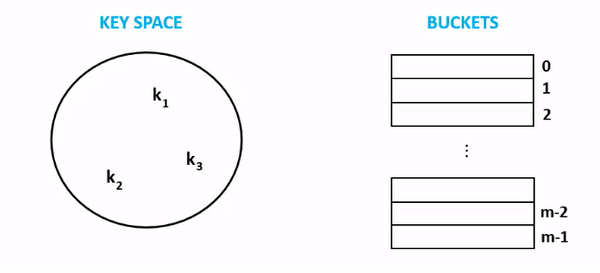

## Open Addressing
One of the implementations of a hash table. The objective of hash table is to store (key, value) pairs with near 
O(1) Search time complexity. The actual storage is done by creating a hashed value of the key using a reproducible algorithm, 
and store it into a "bucket". When retrieving, the same process of creating the hashed value of the key is done, and it is used
to find where the key was initially stored in the bucket. To keep the concept easy to understand, we can assume most buckets 
is a form of implementation of an Array. 

There is however a drawback of this technique, which sometimes as the hash table stores more values, there is a probability of 
computing same hashed value for different set of keys. To overcome this, Open Addressing is a technique of handling collisions 
when it occurs, an extra logic of deciding where to store the key value. 

Open Addressing solves this by finding the next available empty entry in the bucket, and store there instead. 
How it finds the next available entry can be interesting. There are some terms such as 
- linear probing
- quadratic probing
- double hashing

## Time Complexity
Below are average cases scenario, without going into collisions often. 
- Search - O(1) - dependent on the algorithm being used. Studies says usage of Universal Hashing is recommended. The algorithm used to 
compute the hash can be sometimes skewed due to the data input. So choosing a random algorithm in a bag of algorithms helps average out skewed data. 
- Delete - O(1) - Dependent on Search complexity. As it is required to first find the hashed value, then being able to access the correct bucket. 
- Store - O(1) -  Dependent on Search complexity. As it is required to first find the hashed value, then being able to access the correct bucket. 

## Use cases

