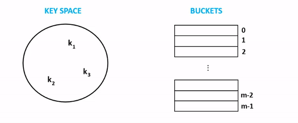

## Separate Chaining

One of the implementations of a hash table. The objective of hash table
is to store (key, value) pairs with near O(1) Search time complexity.
The actual storage is done by creating a hashed value of the key using a
reproducible algorithm, and store it into a "bucket". When retrieving,
the same process of creating the hashed value of the key is done, and it
is used to find where the key was initially stored in the bucket. To
keep the concept easy to understand, we can assume most buckets is a
form of implementation of an Array. Arrays have an O(1) indexing
behavior if you know the index number. Thus computation of the hashed
key needs to create some kind of number.

There is however a drawback of this technique, which sometimes as the
hash table stores more values, there is a probability of computing same
hashed value for different set of keys. To overcome this, Open
Addressing is a technique of handling collisions when it occurs, an
extra logic of deciding where to store the key value. ## Open Addressing
One of the implementations of a hash table. The objective of hash table is to store (key, value) pairs with near
O(1) Search time complexity. The actual storage is done by creating a hashed value of the key using a reproducible algorithm,
and store it into a "bucket". When retrieving, the same process of creating the hashed value of the key is done, and it is used
to find where the key was initially stored in the bucket. To keep the concept easy to understand, we can assume most buckets
is a form of implementation of an Array.

There is however a drawback of this technique, which sometimes as the hash table stores more values, there is a probability of
computing same hashed value for different set of keys. To overcome this, Chaining solves this by storing a LinkedList of Nodes in the bucket,
instead of the Node itself. When there is a collision, it simply appends
to the same bucket entry, which is a linkedlist object with the new
value

## Time Complexity

Below are average cases scenario, without going into collisions often.
- Search O(Load factor) - equals to the load factor on average as a bucket is a linked
  list. It potentially need to iterate every node to get to the required
  node. This is also assuming the hashing algorithm used was suitable.
- Delete - O(1) - Dependent on Search complexity. As it is required to
  first find the hashed value, then being able to delete node from the correct
  bucket.
- Store - O(1) - Dependent on Search complexity. As it is required to
  first find the hashed value, then being able to store from the correct
  bucket.

## Space Complexity

As Chaining implementation is used, it is known to split its effort on reusing the same bucket as it can append
more data vs expanding the Array size to store the key value on empty buckets. Due to this behavior, the bigger
the hash table becomes, the more memory inefficient it becomes. It potentially can create very long linked lists of same buckets, and
buckets that doesn't have any linkedlists stored. This is based on probability of the result of re-hashing algorithm.

## How It Works

- Step 1 - Key 1's hash value is generated with a value of 0, and is
  inserted into bucket 0
- Step 2 - Key 2's hash value is generated with a value of m-2, is
  inserted into 2nd bucket from last
- Step 3 - Key 3's hash value is generated with a value of m-2, same as
  step 2. There is a collision now. Since the object that holds the
  value is a linked list, it simply appends another node to the same
  current bucket as part of the linked list.

