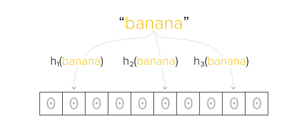
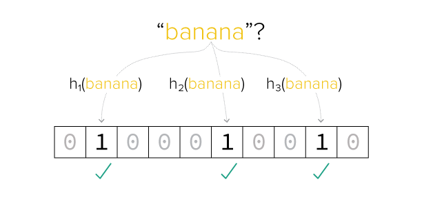
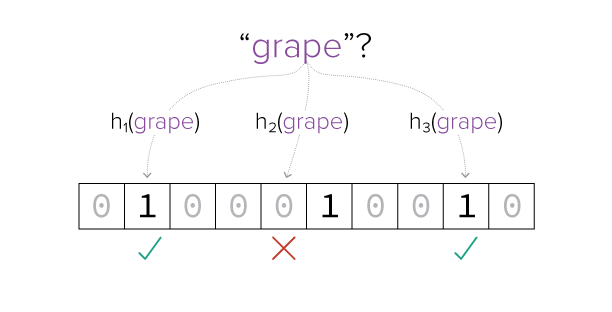
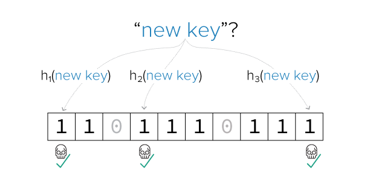

## Bloom Filters
Bloom filters are used for storing unique inputs and is like a "cache" for checking for unique inputs in the fture. A lot of data structures 
 can do the same thing such as Sets, HashMap. Bloom filters are great if you'd like to have low memory requirements without the need of storing the actual values while taking into account the calculation of 
 false positives occurrences, and speed of searching. It is used quite frequently in Big data and Advertisement engineering departments.
## Time Complexity
This dependent on the number of hash functions being used and the underlying data structure that will store the bits. 
Assuming the underlying storage `bit array` there is should be O(1) access to any elements. Multiplying the 
number of hash functions used h(x) * O(1). A better question is, what is the compute and memory complexity bloom filters?  

## Use cases
 - Check if a user name already exists in registeration page. 
 - Counting of unique visitors to your website
 - Blacklist IP addresses from reaching your website or going through fire walls. (The great fire wall?)

1. Compute results that finger prints the bit array. The hash function being used for a same given input should be reproducible. 

2. That means if "banana" comes back again, it would create the same fingerprint. 

3. If a different string comes in, we compute the finger prints again and compare it with the bit array. All of the bits need flip to "true" to be sure that the string was never recorded.

4. There's possibility of false positives when an input that was never stored into bloom filter. This should be taken into account when using this data structure. (dependent on your initial memory allocation for actual percentage, there is a mathematical formula for this).

Regarding the 4th point itself, an additional work can be done to reduce false positives from let's say 1% to almost 0 which is rebuilding 
Bloom Filters if it gets too big. The typical downside of bloom filter is that hash functions sometimes creates 
collision of keys. Hash Maps already solved this problem through Open Addressing collision resolving techniques. There is something called
[Cuckoo Filter](https://en.wikipedia.org/wiki/Cuckoo_filter). Though if there is a need to implement Cuckoo filter, you'd probably want use 
multiple infrastructure, not just one server to maintain high performance of read and availability to your applications.
