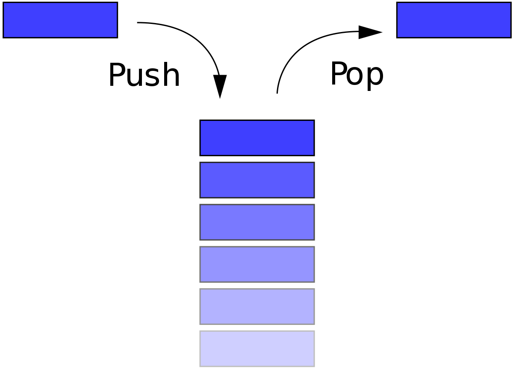

## Stacks
The basis of Stacks is the LIFO concept where items that are last "pushed" into 
store are also the first item to be "popped" out. 

## Implementations
There are multiple ways to implement Stack. In ruby, the basic "_Array_" standard
object already acts like a Stack with its notable methods of "#.pop()" and "#.push()"
 
Another way is via "_LinkedList_" where the "head" of the list is the last object being inserted 
and constantly updated as the new head when new items are being pushed. 

### LinkedList
Because a singly-linked list supports O(1) time prepend and delete-first, the cost to push or pop into a linked-list-backed stack is also O(1) worst-case. However, each new element added requires a new allocation, and allocations can be expensive compared to other operations.

### (Dynamic) Array
Pushing onto the stack can be implemented by appending a new element to the dynamic array, which takes amortized O(1) time and worst-case O(n) time. Popping from the stack can be implemented by just removing the last element, which runs in worst-case O(1) (or amortized O(1) if you want to try to reclaim unused space). In other words, the most common implementation has best-case O(1) push and pop, worst-case O(n) push and O(1) pop, and amortized O(1) push and O(1) pop.

## Use cases
- Testing for symmetry. It can be used in parsers. For example a JSON parser needs to check balancing brackets. 
- Has a special property of reversing order for a given stream of inputs, and then outputting the same stream. 
- Can be implemented as "Undo" storing command for systems. (The "Redo" command would be another stack storing the output of the "Undo" stack) 

 Credits to Wikipedia
