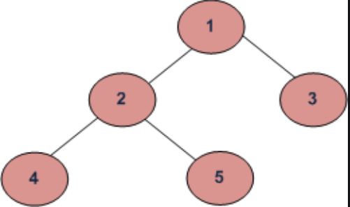

TODO:
- https://www.geeksforgeeks.org/convert-normal-bst-balanced-bst/

## Binary Search Tree
- Binary Tree = A tree that has two children
- Sorted Tree = Descendents of the left are smaller than current node. Descendents on the right side should be larger than the current node. This applies to all nodes and its descendents.

Binary Tree + Sorted Tree = Binary Search Tree

Also following rules applies to BST:
1. The left subtree of a node contains only nodes with keys lesser than the node’s key.
2. The right subtree of a node contains only nodes with keys greater than the node’s key.
3. The left and right subtree each must also be a binary search tree.
4. There must be no duplicate nodes.

`*Notice the value "12" which is on the left node is greater than the value of "8" at the root node. *`

## Traversal
For any Binary Trees, there are two ways to traverse 
1. Breadth First Traversal (also known as Level Order)
2. Depth First Traversal (Traverse the same way, just output data in different orders. )
     - Inorder Traversal (Left-Root-Right)
     - Preorder Traversal (Root-Left-Right)
     - Postorder Traversal (Left-Right-Root)

Consider the following chart (not Binary Search Tree, just normal Binary Tree. 
The values in the nodes are figure annotations, not actual values stored in a node)

### BFS and DFSs of above Tree
#### Breadth First Traversal: 
- 1 2 3 4 5

#### Depth First Traversals:
- Inorder Traversal  :  4 2 5 1 3
- Preorder Traversal : 1 2 4 5 3
- Postorder Traversal : 4 5 2 3 1

## Time Complexity Analysis
BST 