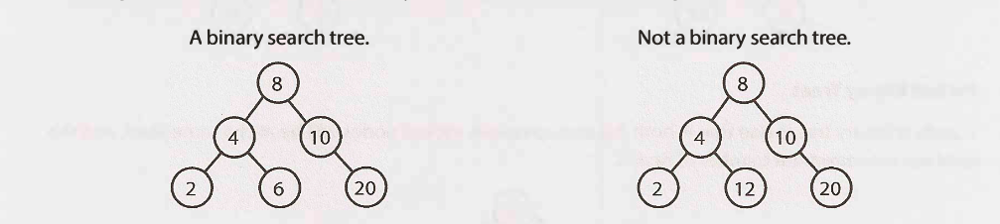

## Binary Search Tree
- Binary Tree = A tree that has two children
- Sorted Tree = Descendents of the left are smaller than current node. Descendents on the right side should be larger than the current node. This applies to all nodes and its descendents.

Binary Tree + Sorted Tree = Binary Search Tree

## Time Complexity Analysis

## Use Cases

