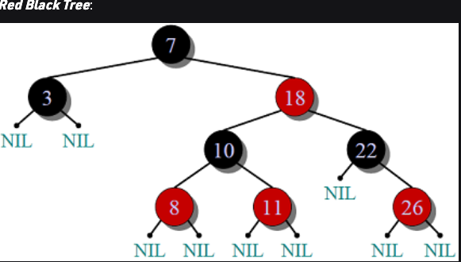

## Red Black Tree - 1972 by Rudolf Bayer. A self balancing Binary Search Tree
- https://www.geeksforgeeks.org/red-black-tree-set-1-introduction-2/
- https://www.geeksforgeeks.org/red-black-tree-vs-avl-tree/

## Rules That Every Red-Black Tree Follows:

1. Every node has a colour either red or black.
2. The root of the tree is always black.
3. There are no two adjacent red nodes (A red node cannot have a red parent or red child).
4. Every path from a node (including root) to any of its descendants NULL nodes has the same number of black nodes.

## Why Red-Black Trees?

Most of the BST operations (e.g., search, max, min, insert, delete.. etc) take O(h) time where h is the height of the
BST. The cost of these operations may become O(n) for a skewed Binary tree. If we make sure that the height of the tree
remains O(log n) after every insertion and deletion, then we can guarantee an upper bound of O(log n) for all these
operations. The height of a Red-Black tree is always O(log n) where n is the number of nodes in the tree. 